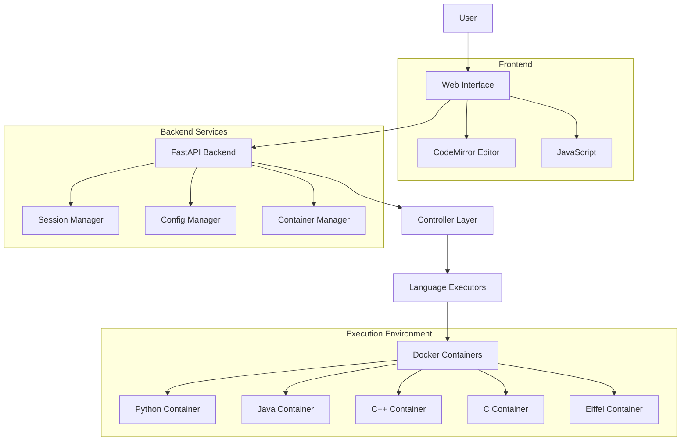

# CodeForge

*This was produced using vibe coding (Copilot and VSCode). The eiffel/autoproof docker images were created manually.*

A modern, Docker-integrated web-based code compiler and runner built with FastAPI that supports multiple programming languages with advanced features like execution cancellation, multi-file projects, and real-time status monitoring.

## 🚀 Features

### Core Capabilities
- **Multi-language Support**: Python, C, C++, Java, Eiffel
- **Multi-file Projects**: Support for complex projects with multiple source files
- **Real-time Execution**: Non-blocking code execution with live status updates
- **Execution Control**: Cancel running processes and configurable timeouts (5-300 seconds)
- **Docker Integration**: Secure containerized code execution
- **Session Management**: Persistent user sessions with container tracking

### User Interface
- **Modern UI**: Clean, responsive web interface with syntax highlighting
- **Code Editor**: CodeMirror-powered editor with search functionality (Ctrl+F)
- **File Tabs**: Multi-file editing with tab-based interface
- **Library Browser**: Eiffel library class browser with syntax highlighting
- **Output Section**: Collapsible output with close functionality (Escape key)

### Technical Features
- **Example Library**: Built-in code examples for all supported languages
- **API Documentation**: Comprehensive OpenAPI/Swagger documentation
- **Testing**: Extensive test suite covering all languages and features

## 🏗️ Architecture

### System Overview



### Backend Components

- **FastAPI Framework**: Modern async web framework with automatic API documentation
- **Modular Controllers**: Refactored from monolithic design into specialized controllers:
  - `execution_controller.py` - Code compilation, execution, verification, and cancellation
  - `session_controller.py` - Session management and cleanup operations
  - `examples_controller.py` - Example code loading and management
  - `library_controller.py` - Eiffel library browsing functionality
  - `shared_utils.py` - Common utility functions across controllers
- **Docker Container Management**: Secure containerized execution environment
- **Language Executors**: Pluggable executor system for different programming languages
- **Session Management**: User session tracking with container lifecycle management

### Frontend Components

- **Responsive Design**: Mobile-friendly interface with Constructor.ch academic styling
- **CodeMirror Integration**: Advanced code editor with syntax highlighting and search
- **Real-time Updates**: Live status monitoring and execution feedback
- **Multi-file Support**: Tab-based file management interface

### Security & Isolation
- **Docker Containers**: Each session runs in isolated Docker containers
- **Process Management**: Background threading with timeout protection
- **Temporary Files**: Secure file handling with automatic cleanup
- **Session Isolation**: User sessions are completely isolated from each other

## 📋 Requirements

### System Requirements
- **Python**: 3.10+
- **Docker**: For containerized code execution
- **Modern Browser**: Tested on Chrome

## 🔧 Installation & Setup

### Option 1: Quick Setup (Recommended)

```bash
# Clone the repository
git clone <repository-url>
cd ap_online

# Run automated setup (installs dependencies, sets up Docker, creates venv)
./scripts/setup.sh

# Start the application
./run.sh
```

### Option 2: Docker Development

```bash
# Use Docker Compose for full containerized development
docker-compose -f docker/docker-compose.yml up --build
```

## 🚀 Usage

### Quick Start
```bash
# Start the application
./run.sh

# Open in browser
http://localhost:8000
```

### API Documentation

Visit `http://localhost:8000/api/docs` for interactive Swagger documentation.
   source venv/bin/activate
   ```

2. **Start the server**:
   ```bash
   python3 main.py
   # or
   ./start.sh
   ```

3. **Open your browser** and navigate to:
   ```
   http://localhost:8000
   ```

4. **Write or select code**:
   - Choose a programming language
   - Write code in the editor or select from examples
   - Set execution timeout (5-300 seconds, default: 30s)

5. **Run and control execution**:
   - Click "Run Code" to execute
   - Use "Cancel" button to stop long-running processes
   - View real-time execution status and output