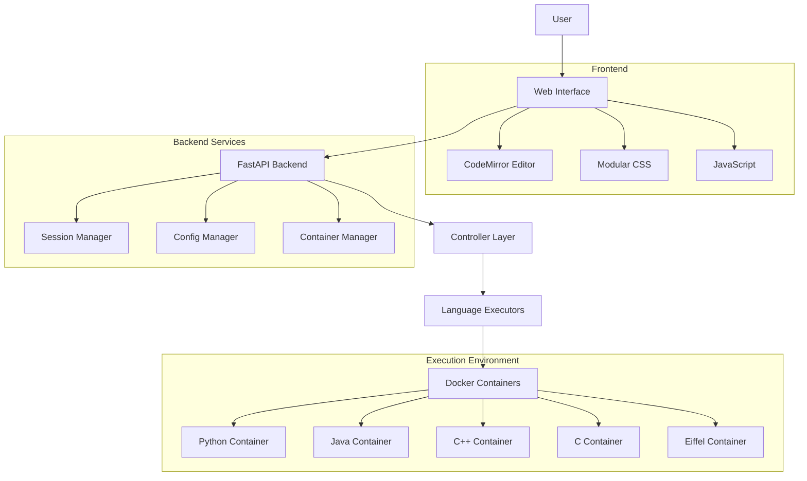
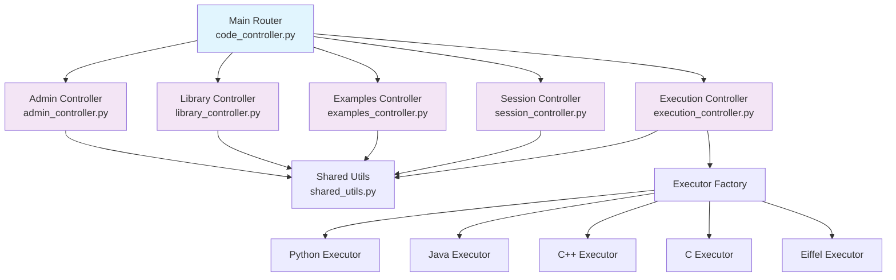
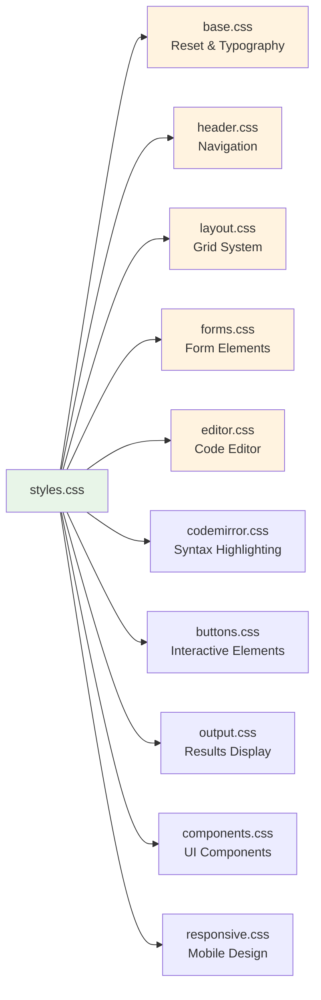
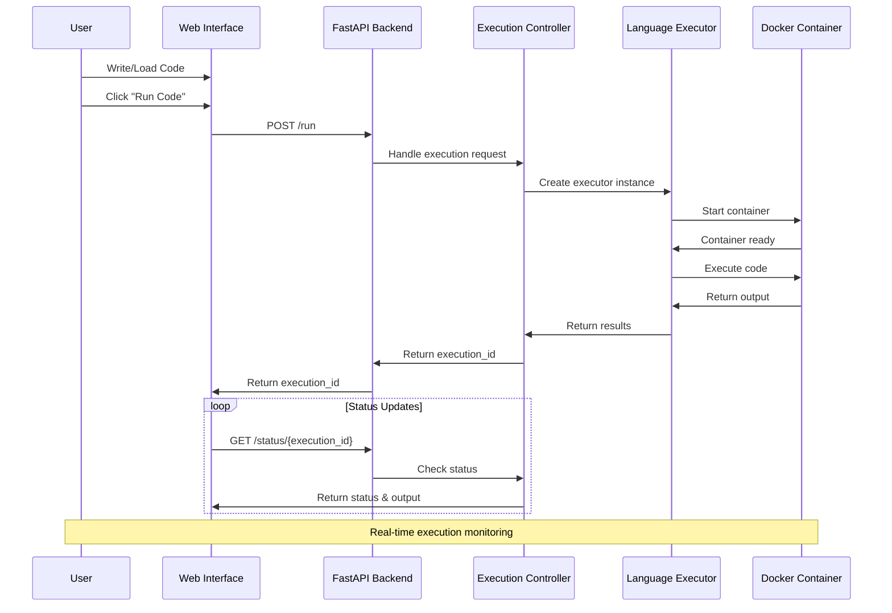
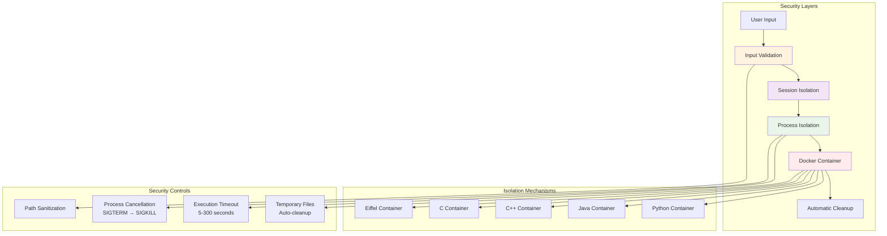

# CodeForge

A modern, Docker-integrated web-based code compiler and runner built with FastAPI that supports multiple programming languages with advanced features like execution cancellation, multi-file projects, and real-time status monitoring.

## 🚀 Features

### Core Capabilities
- **Multi-language Support**: Python, C, C++, Java, Eiffel
- **Multi-file Projects**: Support for complex projects with multiple source files
- **Real-time Execution**: Non-blocking code execution with live status updates
- **Execution Control**: Cancel running processes and configurable timeouts (5-300 seconds)
- **Docker Integration**: Secure containerized code execution
- **Session Management**: Persistent user sessions with container tracking

### User Interface
- **Modern UI**: Clean, responsive web interface with syntax highlighting
- **Code Editor**: CodeMirror-powered editor with search functionality (Ctrl+F)
- **File Tabs**: Multi-file editing with tab-based interface
- **Library Browser**: Eiffel library class browser with syntax highlighting
- **Output Section**: Collapsible output with close functionality (Escape key)

### Technical Features
- **Modular Architecture**: Refactored codebase with specialized controllers
- **Configurable**: JSON-based compiler configuration system
- **Example Library**: Built-in code examples for all supported languages
- **API Documentation**: Comprehensive OpenAPI/Swagger documentation
- **Testing**: Extensive test suite covering all languages and features

## 🏗️ Architecture

### System Overview



### Recent Refactoring (2025)

The application has undergone significant architectural improvements:

**Controller Refactoring**: Split the monolithic 617-line `code_controller.py` into specialized modules:
- **Separation of Concerns**: Each controller now handles a specific domain (execution, sessions, examples, etc.)
- **Improved Maintainability**: Smaller, focused modules are easier to understand and modify
- **Better Testing**: Isolated functionality enables more targeted unit tests
- **Global State Management**: Proper handling of shared configuration and state

**CSS Modularization**: Refactored the large 1156-line `styles.css` into 10 specialized stylesheets:
- **Component-Based Styling**: Each CSS file handles specific UI components
- **Improved Organization**: Related styles are grouped together logically
- **Better Maintainability**: Easier to find and modify specific styling rules
- **Performance**: Modular imports allow for better caching and loading strategies

**Bug Fixes and Improvements**:
- Fixed global variable sharing between refactored modules
- Corrected file extension handling for C++ (`.cpp`) and C (`.c`) executors
- Enhanced test suite with proper session initialization
- Improved error handling across all language executors

### Backend Components



- **FastAPI Framework**: Modern async web framework with automatic API documentation
- **Modular Controllers**: Refactored from monolithic design into specialized controllers:
  - `execution_controller.py` - Code compilation, execution, verification, and cancellation
  - `session_controller.py` - Session management and cleanup operations
  - `examples_controller.py` - Example code loading and management
  - `library_controller.py` - Eiffel library browsing functionality
  - `shared_utils.py` - Common utility functions across controllers
- **Docker Container Management**: Secure containerized execution environment
- **Language Executors**: Pluggable executor system for different programming languages
- **Session Management**: User session tracking with container lifecycle management

### Frontend Components



- **Responsive Design**: Mobile-friendly interface with Constructor.ch academic styling
- **Modular CSS Architecture**: Refactored from monolithic design into specialized stylesheets:
  - `base.css` - CSS reset, typography, and foundational styles
  - `header.css` - Header section and navigation styling
  - `layout.css` - Main layout structure and grid systems
  - `forms.css` - Form elements and settings panel styling
  - `editor.css` - Code editor interface and tab management
  - `codemirror.css` - CodeMirror integration and syntax highlighting
  - `buttons.css` - Button styles and interactive elements
  - `output.css` - Output section and result display
  - `components.css` - Reusable UI components
  - `responsive.css` - Mobile and responsive design rules
- **CodeMirror Integration**: Advanced code editor with syntax highlighting and search
- **Real-time Updates**: Live status monitoring and execution feedback
- **Multi-file Support**: Tab-based file management interface

### Security & Isolation
- **Docker Containers**: Each session runs in isolated Docker containers
- **Process Management**: Background threading with timeout protection
- **Temporary Files**: Secure file handling with automatic cleanup
- **Session Isolation**: User sessions are completely isolated from each other

## 📋 Requirements

### System Requirements
- **Python**: 3.8+ (3.10+ recommended)
- **Docker**: For containerized code execution
- **Modern Browser**: Chrome, Firefox, Safari, or Edge

### Development Tools (for local development)
- **GCC/G++**: For C/C++ compilation
- **Java JDK**: For Java compilation  
- **Eiffel Studio**: For Eiffel development (optional)

### Supported Platforms
- **Linux**: Primary platform (Ubuntu 20.04+ recommended)
- **macOS**: Full support with Docker Desktop
- **Windows**: Via WSL2 with Docker Desktop

## 🔧 Installation & Setup

### Option 1: Quick Setup (Recommended)

```bash
# Clone the repository
git clone <repository-url>
cd ap_online

# Run automated setup (installs dependencies, sets up Docker, creates venv)
./scripts/setup.sh

# Start the application
./run.sh
```

### Option 2: Manual Setup

```bash
# Clone the repository
git clone <repository-url>
cd ap_online

# Create and activate virtual environment
python3 -m venv venv
source venv/bin/activate  # On Windows: venv\Scripts\activate

# Install Python dependencies
pip install -r requirements.txt

# Set up Docker images for code execution
./docker/build-images.sh

# Start the application
python src/main.py
```

### Option 3: Docker Development

```bash
# Use Docker Compose for full containerized development
docker-compose -f docker/docker-compose.yml up --build
```

## 🚀 Usage

### Quick Start
```bash
# Start the application
./run.sh

# Open in browser
http://localhost:8000
```

### Web Interface Features

1. **Code Editor**
   - Multi-file project support with tabs
   - Syntax highlighting for all supported languages
   - Search functionality (Ctrl+F, Ctrl+G for find next, Ctrl+H for replace)
   - Configurable editor settings

2. **Language Selection**
   - Choose from Python, C, C++, Java, Eiffel
   - Load example code for quick testing
   - Language-specific compilation settings

3. **Execution Control**
   - Compile-only mode for syntax checking
   - Run mode for full execution
   - Verify mode for Eiffel contracts
   - Configurable timeout (5-300 seconds)
   - Cancel execution button for long-running processes

4. **Eiffel Library Browser**
   - Browse Eiffel library classes
   - Syntax-highlighted source code display
   - Resizable and searchable interface

### Code Execution Workflow



### API Endpoints

The application provides a comprehensive REST API organized by controller modules:

**Code Execution** (`execution_controller.py`)
- `POST /compile` - Compile source code
- `POST /run` - Execute code
- `POST /verify` - Verify Eiffel contracts
- `POST /cancel` - Cancel running execution
- `GET /status/{execution_id}` - Get execution status

**Session Management** (`session_controller.py`)
- `GET /session/info` - Get session information
- `POST /session/cleanup` - Clean up session

**Examples & Library** (`examples_controller.py`, `library_controller.py`)
- `GET /examples` - List available examples
- `GET /examples/{language}/{filename}` - Get example code
- `GET /eiffel/library/{class_name}` - Get Eiffel library class

**Administration** (`admin_controller.py`)
- `GET /admin/config` - Get configuration
- `POST /admin/config` - Update configuration
- `GET /admin/containers` - Get container statistics
- `POST /admin/cleanup` - Clean up old containers

### API Documentation

Visit `http://localhost:8000/api/docs` for interactive Swagger documentation.
   source venv/bin/activate
   ```

2. **Start the server**:
   ```bash
   python3 main.py
   # or
   ./start.sh
   ```

3. **Open your browser** and navigate to:
   ```
   http://localhost:8000
   ```

4. **Write or select code**:
   - Choose a programming language
   - Write code in the editor or select from examples
   - Set execution timeout (5-300 seconds, default: 30s)

5. **Run and control execution**:
   - Click "Run Code" to execute
   - Use "Cancel" button to stop long-running processes
   - View real-time execution status and output

## ⚙️ Configuration

The compiler settings are stored in `config/compiler_config.json`:

```json
{
    "compilers": {
        "python": {
            "compile_cmd": "",
            "run_cmd": "python {file}"
        },
        "c": {
            "compile_cmd": "gcc {file} -o {output}",
            "run_cmd": "{output}"
        },
        "cpp": {
            "compile_cmd": "g++ {file} -o {output}",
            "run_cmd": "{output}"
        },
        "java": {
            "compile_cmd": "javac {file}",
            "run_cmd": "java {classname}"
        }
    },
    "default_language": "python"
}
```

## 📁 Project Structure

```mermaid
graph TD
    Root[ap_online/] --> Src[src/]
    Root --> Docker[docker/]
    Root --> Examples[examples/]
    Root --> Tests[tests/]
    Root --> Scripts[scripts/]
    
    Src --> Controllers[controllers/]
    Src --> Executors[language_executor/]
    Src --> Static[static/]
    Src --> Templates[templates/]
    Src --> Config[config/]
    
    Controllers --> MainCtrl[code_controller.py]
    Controllers --> ExecCtrl[execution_controller.py]
    Controllers --> SessionCtrl[session_controller.py]
    Controllers --> ExampleCtrl[examples_controller.py]
    Controllers --> LibCtrl[library_controller.py]
    Controllers --> AdminCtrl[admin_controller.py]
    Controllers --> Utils[shared_utils.py]
    
    Executors --> Base[base.py]
    Executors --> Factory[factory.py]
    Executors --> Python[python_executor.py]
    Executors --> Java[java_executor.py]
    Executors --> Cpp[cpp_executor.py]
    Executors --> C[c_executor.py]
    Executors --> Eiffel[eiffel_executor.py]
    
    Static --> CSS[css/]
    Static --> JS[js/]
    CSS --> Styles[styles.css]
    CSS --> Modular[10 modular CSS files]
    
    style Root fill:#e3f2fd
    style Src fill:#f3e5f5
    style Controllers fill:#fff3e0
    style Executors fill:#e8f5e8
    style Static fill:#fce4ec
```



```
ap_online/
├── README.md                # Project documentation
├── TABBED_EDITOR.md        # Multi-file editor documentation
├── requirements.txt        # Python dependencies
├── run.sh                  # Convenience script to start server
├── pytest.ini             # Test configuration
├── src/                   # Application source code
│   ├── __init__.py        # Python package init
│   ├── main.py            # FastAPI application entry point
│   ├── container_manager.py # Docker container management
│   ├── config_manager.py  # Configuration management utilities
│   ├── models.py          # Data models and schemas
│   ├── controllers/       # Modular controller architecture
│   │   ├── __init__.py    # Controllers package init
│   │   ├── code_controller.py     # Main router combining all controllers
│   │   ├── execution_controller.py # Code execution operations
│   │   ├── session_controller.py  # Session management
│   │   ├── examples_controller.py # Example code handling
│   │   ├── library_controller.py  # Eiffel library browser
│   │   ├── admin_controller.py    # Admin and configuration endpoints
│   │   └── shared_utils.py        # Common utility functions
│   ├── language_executor/ # Language-specific execution engines
│   │   ├── __init__.py    # Package init
│   │   ├── base.py        # Base executor interface
│   │   ├── factory.py     # Executor factory pattern
│   │   ├── python_executor.py # Python code execution
│   │   ├── c_executor.py      # C code execution
│   │   ├── cpp_executor.py    # C++ code execution
│   │   ├── java_executor.py   # Java code execution
│   │   └── eiffel_executor.py # Eiffel code execution
│   ├── config/
│   │   └── languages.json       # Language definitions
│   ├── static/            # Static web assets
│   │   ├── favicon.svg    # Application favicon
│   │   ├── css/           # Modular CSS architecture
│   │   │   ├── styles.css     # Main CSS with imports
│   │   │   ├── base.css       # Reset and typography
│   │   │   ├── header.css     # Header styling
│   │   │   ├── layout.css     # Layout structure
│   │   │   ├── forms.css      # Form elements
│   │   │   ├── editor.css     # Code editor interface
│   │   │   ├── codemirror.css # CodeMirror integration
│   │   │   ├── buttons.css    # Button styles
│   │   │   ├── output.css     # Output section
│   │   │   ├── components.css # UI components
│   │   │   └── responsive.css # Responsive design
│   │   └── js/
│   │       └── script.js  # Frontend JavaScript
│   └── templates/
│       └── index.html     # Main HTML template
├── scripts/               # Setup and utility scripts
│   ├── setup.sh          # Project setup script
│   ├── setup-docker.sh   # Docker setup script
│   ├── start.sh          # Server startup script
│   └── test_setup.py     # Setup testing script
├── docker/               # Docker configuration
│   ├── Dockerfile        # Main application container
│   ├── Dockerfile.execution # Code execution container
│   ├── Dockerfile.python    # Python execution container
│   ├── Dockerfile.c         # C execution container
│   ├── Dockerfile.cpp       # C++ execution container
│   ├── Dockerfile.java      # Java execution container
│   ├── Dockerfile.eiffel    # Eiffel execution container
│   ├── build-images.sh      # Docker image build script
│   ├── docker-compose.yml  # Docker compose configuration
│   └── docker-compose.multi-lang.yml # Multi-language setup
├── examples/             # Code examples organized by language
│   ├── examples_index.json # Example metadata
│   ├── python/           # Python examples
│   │   ├── hello_world.py
│   │   ├── calculator.py
│   │   ├── fibonacci.py
│   │   └── infinite_loop.py
│   ├── c/               # C examples
│   │   ├── hello_world.c
│   │   ├── calculator.c
│   │   └── infinite_loop.c
│   ├── cpp/             # C++ examples
│   │   ├── hello_world.cpp
│   │   └── calculator.cpp
│   ├── java/            # Java examples
│   │   ├── HelloWorld.java
│   │   └── Calculator.java
│   └── eiffel/          # Eiffel examples
│       ├── hello_world.e
│       ├── calculator.e
│       └── ecf_template.xml
├── tests/               # Comprehensive test suite
│   ├── conftest.py      # Test configuration
│   ├── test_api.py      # API endpoint tests
│   ├── test_general.py  # General functionality tests
│   ├── test_python.py   # Python executor tests
│   ├── test_c.py        # C executor tests
│   ├── test_cpp.py      # C++ executor tests
│   ├── test_java.py     # Java executor tests
│   ├── test_eiffel.py   # Eiffel executor tests
│   └── test_multifile.py # Multi-file project tests
└── venv/                # Virtual environment (git-ignored)
```

## 🔒 Security Features



- **Docker Containers**: Each session runs in isolated Docker containers
- **Process Isolation**: Each execution runs in a separate subprocess  
- **Timeout Protection**: Configurable execution timeouts prevent infinite loops
- **Temporary Files**: Automatic cleanup of generated files
- **Graceful Termination**: Proper process cleanup with fallback to force kill
- **Input Validation**: Sanitized file paths and commands
- **Session Isolation**: User sessions are completely isolated from each other

## 🔧 Advanced Features

### Execution Control

- **Non-blocking execution**: Run code without freezing the UI
- **Real-time status**: Live updates on execution progress
- **Cancellation**: Stop long-running or infinite loop processes
- **Timeout handling**: Automatic termination after specified duration

### Process Management

- **Background threading**: Executions run in separate threads
- **Process tracking**: Active process monitoring and cleanup
- **Graceful termination**: SIGTERM followed by SIGKILL if needed
- **Resource cleanup**: Automatic temporary file removal

## 🐛 Troubleshooting

### Common Issues

1. **Compilation errors**: Ensure required compilers are installed and in PATH
2. **Permission errors**: Check file system permissions for temporary directories
3. **Process hanging**: Use the cancel button or check timeout settings
4. **Port conflicts**: Change the port in `main.py` if 8000 is occupied

### Debug Mode

Run with debug logging:

```bash
python src/main.py --debug
```

## 🤝 Contributing

1. Fork the repository
2. Create a feature branch
3. Make your changes
4. Add tests if applicable
5. Submit a pull request

## 📝 License

This project is open source. Please check the license file for details.

## 🙏 Acknowledgments

- FastAPI for the excellent web framework
- CodeMirror for the advanced code editor
- Docker for containerization technology
- The open source community for compiler tools
- Contributors and testers who helped improve the application